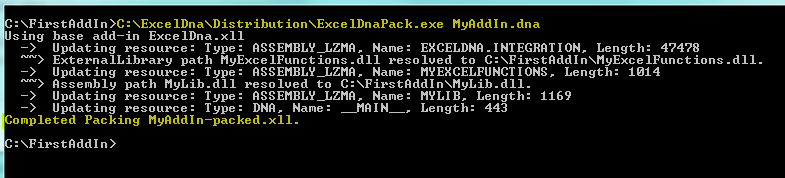

Excel-DNA has a packing tool that allows you to create a single-file .xll add-in.

When run on an add-in, the packing tool will compress and embed as resources into the .xll file the various parts of your add-in. The result is a single .xll file which contains your add-in and can be easily distributed. (The appropriate version of the .NET framework is still required on the client PC for your add-in to load.)

# Usage

The packing program is called `ExcelDnaPack.exe` and is located in the `Distribution` directory in the Excel-DNA download.

**`Usage: ExcelDnaPack.exe dnaPath [/O outputPath] [/Y]`**

:  dnaPath      The path to the primary .dna file for the ExcelDna add-in.
:  /Y           If the output .xll exists, overwrite without prompting.
:  /O outPath   Output path - default is <dnaPath>-packed.xll

## Preparation

Ensure that your add-in, including the required add-in assemblies and additional dependencies are working correctly from some directory. You might have the following files in `C:\FirstAddIn\`

- `MyAddIn.dna`
- `MyAddIn.xll` _(a renamed copy of ExcelDna.xll from the distribution)_
- `MyExcelFunctions.dll`
- `MyLib.dll`

where `MyExcelFunctions.dll` contains the add-in functions that are exported to Excel, and `MyLib.dll` is a .NET assembly that is used by `MyExcelFunctions.dll` but is not directly exported to Excel.

Update the .dna file to look like this

```xml
<DnaLibrary Name="My First AddIn" RuntimeVersion="v4.0" >
  <ExternalLibrary Path="MyExcelFunctions.dll" Pack="true" />
    <Reference Path="MyLib.dll" Pack="true" />
</DnaLibrary>
```

Note the following:
- I've added a `Pack="true"` attribute to the `ExternalLibrary` tag, to indicate that this assembly should be packed.
- I've added an extra `<Reference Path=... Pack="true">` tag for the referenced assembly. The `Pack="true"` directive tells ExcelDnaPack to embed the `MyLib.dll` assembly into the .xll file and resolve the reference at runtime from this embedded resource.

One everything is in place, it's good to check that your add-in still works.

## Packing

Now run the packing program. From a command prompt, go to the `C:\FirstAddIn\` directory and run `ExcelDnaPack.exe MyAddIn.dna`.

The output should look something like this:



The result of the packing is a file called `MyAddIn-packed.xll`. This is the standalone .xll file, and can now be copied somewhere else and renamed to test.

## Other packing options

- If your add-in has a `.xll.config` file, say `MyAddIn.xll.config`, it will also be packed. Note that if an actual .xll.config file is present at runtime, it will be loaded instead of the embedded .xll.config file. This allows you to embed a default configuration, and still override it at runtime if required.

- Images can be embedded - useful for CommandBar and Ribbon custom UI extensions. Add tags `<Image Name="ButtonImage" Path="MyButtonImage.png" Pack="true" />` and the image can be used from your ribbon `.xml`.

- .dna files can be nested, and will be embedded according to the Pack attributes: `<ExternalLibrary Path="OtherFile.dna" Pack="true" />`
- SourceItems in Project tags can also be packed.

- The packing can also be incorporated into your build as a post-build step.

## Limitations

Mixed code assemblies (that contain both managed and native code) cannot currently be packed.

# Notes for 64-bit Excel

Note that a separate .xll must be created for the 64-bit version of Excel, using the `ExcelDna64.xll` instead of `ExcelDna.xll`. For the packing, one option is to make and additional .dna file, say `MyAddIn64.dna` and corresponding `MyAddIn64.xll`, which gets packed with `ExcelDnaPack.exe MyAddIn64.dna`. Then the final distribution will have two files:

- `MyAddInFinal.xll` (renamed from MyAddIn-packed.xll)
- `MyAddInFinal64.xll` (renamed from MyAddIn64-packed.xll)
